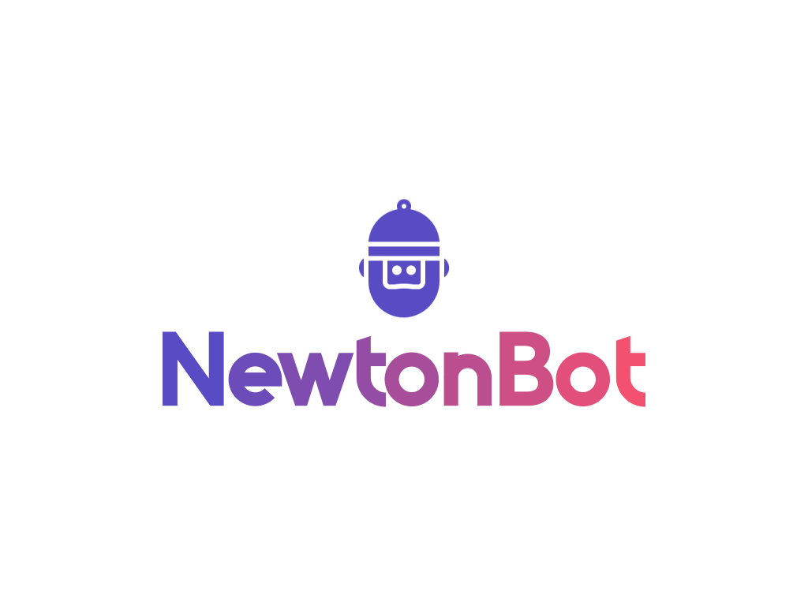

<p align="center">
  
</p>

> > Your Automated Personal Assistant, on WhatsApp!
---
 [](https://github.com/bkimminich/juice-shop/releases/latest)
     

NewtonBot is an optimized and easy-to-use WhatsApp UserBot written in Node.js.

Utilize your personal chat assistant/group manager to make the most out of WhatsApp.   


## Documentation

[Documentation Link](https://github.com/Meghdut-Mandal/NewtonBot)

 
## Tutorial

Here's a tutorial to set up NewtonBot on your own account in *less than 3 minutes.*


## Deployment


### Manually on Heroku

You can deploy the bot the heroku yourself using the button below!

[](https://dashboard.heroku.com/new?button-url=https%3A%2F%2Fgithub.com%2FNewtonBotOfficial%2FNewtonBot%2Ftree%2Fmain&template=https%3A%2F%2Fgithub.com%2FNewtonBotOfficial%2FNewtonBot%2Ftree%2Fmainhttps://dashboard.heroku.com/new?button-url=https%3A%2F%2Fgithub.com%2FNewtonBotOfficial%2FNewtonBot%2Ftree%2Fmain&template=https%3A%2F%2Fgithub.com%2FNewtonBotOfficial%2FNewtonBot%2Ftree%2Fmain)

### Using Docker locally

To follow this method, you will need to have docker installed on your machine and have some experience using docker.

To host the bot on your own device using docker, follow the following steps on your terminal / command prompt -

```bash
git clone https://github.com/Meghdut-Mandal/NewtonBot.git
cd NewtonBot
docker build -t botsapp .
docker run -d -–restart=always --name botsapp botsapp
```

This will create a container running NewtonBot. You'll have to scan the QR at least once.

### The GNU/Linux Legacy Way

To use this method, you will need ffmpeg, nodejs, npm installed on your device.

To run the bot on your device manually, you can use the following commands -

```bash
git clone https://github.com/Meghdut-Mandal/NewtonBot.git
cd NewtonBot
npm install
npm start
```


## Support and Discussion groups

Feel free to post your queries or concerns on any of the discussion forums mentioned below:


## Contributors

<!-- ALL-CONTRIBUTORS-LIST:START - Do not remove or modify this section -->
<!-- prettier-ignore-start -->
<!-- markdownlint-disable -->
<table>
  <tr>
    <td align="center"><a href="https://github.com/Meghdut-Mandal"><br /><sub><b>Meghdut Mandal</b></sub></a><br /><sub><i>Project Lead Developer</i></sub></td>
 </tr>
</table>

<!-- markdownlint-restore -->
<!-- prettier-ignore-end -->

<!-- ALL-CONTRIBUTORS-LIST:END -->


## Inspiration

- Baileys Library

- Yusuf Usta 

- [X-tra-Telegram](https://github.com/Prince-Mendiratta/X-tra-Telegram)

## Copyright & License
- Copyright (C) 2021 - 2022 by [NewtonBot](https://github.com/Meghdut-Mandal/NewtonBot)

- Licensed under the terms by [GNU GENERAL PUBLIC LICENSE](https://github.com/Meghdut-Mandal/NewtonBot/blob/master/LICENSE)

## Legal
This code is in no way affiliated with, authorized, maintained, sponsored or endorsed by WhatsApp or any of its affiliates or subsidiaries. This is an independent and unofficial software. Use at your own risk.